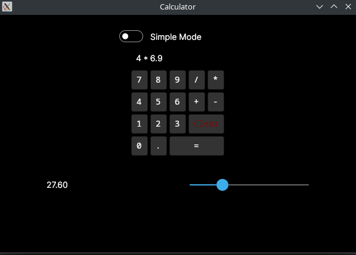
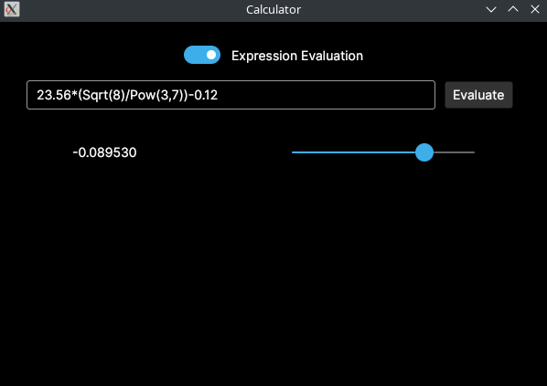

:sectnums:
:nofooter:
:toc: left
:icons: font
:data-uri:
:source-highlighter: highlightjs

= Ava.01 -- Calculator

We start with the most cliche assignment right after 'Hello World': a calculator.

It has two modes:

. Simple mode with a minimal keypad which allows to enter simple expressions with two operands and one operator
. Complex mode which allows to enter a (more or less) arbitrary expression with multiple operands and operators

The user can switch between the two modes at any time using a toggle switch -- state is maintained and restored after switching back.

Solve this assignment using https://avaloniaui.net/[Avalonia UI] in a cross-platform  compatible way.

== Result Display

The result shows either nothing if no calculation result is available, or the result.
Mind that some calculations can lead to a result of `Infinity`.
Additionally, we provide a slider which allows to set the number of decimal places between 0 and 8.

== Simple Mode

* Input happens _exclusively_ via the buttons -- manual entry via keyboard is not supported
* Provide buttons for:
** The numbers 0-9
** The operators +, -, *, /
** The decimal separator .
** Clearing the input
** Performing the calculation (=)
* Arrange those buttons in a `Grid` and work with `ColumnSpan`
* Use a 'Mono' font for the button labels.
* Show the current input in a `TextBlock` above the buttons
* Make sure that only valid input is accepted -- e.g. pressing the decimal separator multiple times or entering an operator after another operator should be ignored
* Put the calculation & input logic into an extra class and don't cram everything into the code-behind of the view

=== Shared Style

There are many buttons and all take more or less the same 'style' attributes.
Instead of copy-pasting you can add a `Grid.Styles` section as a child of the `Grid` and in there define a `Style Selector="Button"` with `Setter` children to set properties like alignment or font for all buttons in the grid at once.

=== 'Parametrized' Event Handler

In XAML we _cannot_ pass parameters to the event handler directly.
While e.g. TypeScript you could do something like `(click)="() => handleClick(42)"` to pass the number `42` to the function `handleClick`, in XAML we have to use a different approach, because the signature of the event handlers is fixed and we also cannot use a lambda in the XAML attribute.

One option is to make use of the `Tag` property.
It can store any string (e.g. a stringified number in our case) which can then be retrieved via the `sender` parameter of the event handler and is useable after casting to the correct type.

== Complex Mode

* In this mode the user can freely enter an expression using the keyboard
* Special functions like `Sqrt`, `Sin`, `Pow` etc. _are_ supported
* The expression is evaluated by
** Either pressing the `Evaluate` button
** Or pressing the `Enter` key in the input field
* The same result output as in simple mode is used
** Including the slider for the number of decimal places
* Put the calculation logic into an extra class again

=== `NCalc`

While it would be a fun exercise (and a good preparation for building compilers later on) to implement an expression parser yourself, we will instead rely on a robust library: https://ncalc.github.io/ncalc/articles/index.html[`NCalc`].

* `NCalc` is MIT licensed and designed for .NET Core, so it runs on all platforms
* Add it to your project by installing the `NCalcSync` NuGet package
** There is also an `async` version, but we don't need it here
* If you spent at least 1 minute to read the documentation you'll figure out that the complex mode is actually much easier to implement than the simple mode 😎

NOTE: Since Avalonia is built on .NET we can use almost all NuGet packages just like in any other .NET project.
The only exception could be packages which include native code if deployed to more restrictive platforms like mobile or WebAssembly.

== Sample Run

video::pics/sample_run.mp4[Sample Run,width=400]