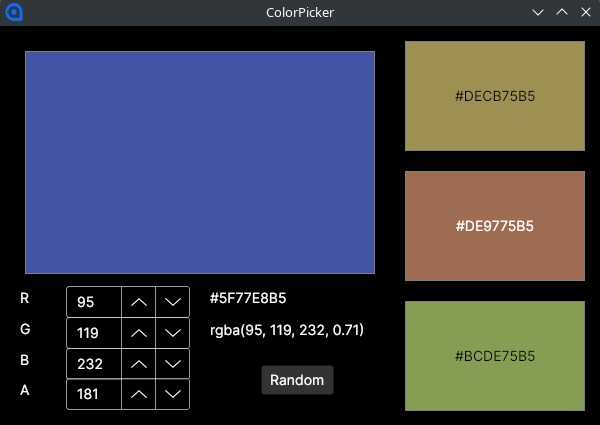

:sectnums:
:nofooter:
:toc: left
:icons: font
:data-uri:
:source-highlighter: highlightjs

= Ava.02 -- ColorPicker

This time we are going to implement the https://docs.avaloniaui.net/docs/concepts/the-mvvm-pattern/avalonia-ui-and-mvvm[MVVM Pattern].
To be exact, we are going to use the https://github.com/CommunityToolkit/dotnet[`CommunityToolkit.Mvvm`] library, which is currently the recommended approach for Avalonia (and also works with WPF).
Another option is the `ReactiveUI` library, which is a bit more complex and not really needed for this assignment -- it is all about pipes, just like `RxJS`.

The assignment is quite strictly _guided_ to make sure that you experience all the various options available for bindings and data updates.

NOTE: I am aware that a dedicated https://docs.avaloniaui.net/docs/reference/controls/colorpicker/[ColorPicker] control exists, but we still implement our own, because it lends itself nicely to dynamic value updates in different ways.

The application has a single window and several controls, each with their own view model:

* A color picker component which allows the user to enter RGB & A values and copy hex & rgba values to the clipboard
* A color preview component which not only displays a color but can optionally also show the hex value
* A component which displays three complementary colors based on the selected color

In WPF/Avalonia it is much less common to create many components -- like we do with e.g. Angular -- and often larger views and view models are used.
However, it is, of course, possible to create components -- called '(user) controls' -- which can be reused or simply separate the logic into smaller parts.
But synchronizing the data between those is less straightforward.

== Model

The model should be _independent_ of any view logic => it shouldn't contain observable properties or any other code needed only for UI purposes.
It could be a service, maybe loading data from an API or a database.
Or it could be a simple POCO -- as it is in our case.

* `ColorData` is a regular, `sealed class` with _mutable_ properties:
** `Red`, `Green`, `Blue`, `Alpha` -- all of type `byte`
* In addition it three _calculated_ properties:
** `Color` -- a `Color` object which is created from the four components
** `Hex` -- a `string` with the hex value of the color (e.g. `#FF0000FF`)
** `Rgba` -- a `string` with the rgba value of the color (e.g. `rgba(255,0,0,0.85)`) as it could be used in CSS
*** Mind that red, green and blue are in the range 0-255 with whole numbers, while alpha is in the range 0-1 as a fractional value
* There are also two _factory methods_:
** `FromColor` takes a `Color` object and returns a `ColorData` object with the four components set accordingly
** `Default` isn't really a method, but a static property which creates a new default `ColorData` object with some dummy values set

NOTE: It is often more convenient to simply put the observable properties into the model and avoid all the dancing around to propagate changes properly, so many people do it, even if the architecture is no longer 'clean'.
However, at least this time we are going to do it the 'right' way.

== Design View Models

For each view model we also declare a `Design*` view model class which typically inherits from the actual view model class and sets some dummy values.

That is needed, because to see anything in the AXAML preview window it needs to be able to construct a view or user control with its view model and _no constructor parameters_ -- that is a technical limitation.
So, we need a version of each view model with a parameterless constructor which sets some dummy values for the sole purpose of displaying it in the design view.

While the real view model instance at runtime is _bound_ to the `DataContext` property, for design time we define the dummy view model as such:

[source,xaml]
----
<Design.DataContext> <1>
    <vm:DesignColorDisplayControlViewModel /> <2>
</Design.DataContext>
----
<1> Put next (sibling) to the content of a view or user control
<2> The design time view model class, depending on the view or user control

You don't _have_ to provide a design time view model, but then you loose the designer preview and will have to start the application to check after every change.

== Color Display

This control is very simple: it shows a rectangle with a certain color and, optionally, a text with the color's hex value on top of it.

=== View Model

* `ColorDisplayControlViewModel`
* Receives a `ColorData` object and sets a _field_; also gets a flag to indicate if the overlay text should be displayed
* Three properties:
.. `Color` -- a `Brush` used for the rectangle fill color
.. `HexOverlayColor` -- a `Brush` used for the overlay text color
.. `HexOverlay` -- a `string` with the hex value of the color
*** Empty string if the overlay is disabled
* Those properties _don't_ have to be `ObservableProperty`, despite us later binding to them
** Because we are going to _manually_ trigger the property changed event(s)
* The `Refresh` method is called whenever the color data changes -- two options:
** The actual _object_ changes, in that case a new one is supplied to the method and set
** Otherwise, the properties of the existing object changed => *`INotifyChanged` does _not_ act on changes _in_ an _existing_ object if the _reference_ stays the same!*
*** You'd have to create new instances, copy over the values and set the new instance to the observable property
*** _Or_ call `OnPropertyChanged` manually => what we are going to do here
**** Don't forget that there are _three_ properties which might change if the color changes
** It is `public` and called from other view models
* The `GetContrastingColor` is already given and will determine for a given color if overlayed text should be black or white https://en.wikipedia.org/wiki/Rec._709[depending on the brightness of the color]

=== View

Mind, that every control (same as a window) can have only _one_ content element.
So to display two, we still need a container -- in this case we use a `Grid` with a single cell.

* `ColorDisplayControl`
* For displaying the color use a `Rectangle`
** _Bind_ the `Fill` property to the `Color` property of the view model
** Set the `Stroke` to `Gray` and the `StrokeThickness` to 1 to display a border
** Vertical and horizontal alignment as `Stretch`
* For the overlay text use a `TextBlock`
** _Bind_ the `Foreground` property to the `HexOverlayColor` property of the view model
** _Bind_ the `Text` property to the `HexOverlay` property of the view model
** Vertical and horizontal alignment as `Center`
* Don't forget to set the design time data context
* Nothing has to be done in the code behind file

== Color Picker

* The user can select values for the Red, Green, Blue & Alpha color components (range 0-255)
** Either via direct entry or by clicking the up/down buttons or by using the mouse wheel -- handled by the `NumericUpDown` control
* The color is displayed above the input fields
** Using the `ColorDisplayControl` implemented in the previous task
* Additionally, the hex and `rgba` values are displayed as well and can be copied to the clipboard

=== View Model

* `ColorPickerControlViewModel`
* Receives a `ColorData` object and sets a _field_
* Has a property with a `ColorDisplayControlViewModel`, because we use a color display control and that needs a view model
* Two _calculated_ properties:
.. `Hex`: provides the hex value of the color
.. `Rgba`: provides the rgba value of the color
* Four _observable_ properties, which also need to trigger updates for `Hex` & `Rgba` when changed:
.. `Red`: a `byte` with the red component
.. `Green`: a `byte` with the green component
.. `Blue`: a `byte` with the blue component
.. `Alpha`: a `byte` with the alpha component
*** We use range 0-255 here as well, only for the `rgba` notation we do 0-1 for the alpha value
* If the user changes a value that would update the observable property, but *not* the value in the `ColorData` object => we need to manually take care of that
* And we also need to call the `Refresh` method of the `ColorDisplayControlViewModel` to update the color display -- it would not be updated automatically either!
* Additionally, we have to _notify_ a different view model (that of the complementary colors) about the color change without holding a reference to it => see messaging section below
* I recommend making use of the source generated `On*Changed` methods to hook into the change event of the observable properties
** Within these methods update the `ColorData` object and then call a shared method which notifies the other view models

=== Messaging [[sec:messaging]]

Whenever we want to exchange data between _decoupled_ objects, we need a sort of _broker_ in between that knows both sides and can relay messages between them.
Typically, that is done in a _publish/subscribe_ pattern, where one side _publishes_ a message and the other side _subscribes_ to it.
Luckily, we don't have to implement that ourselves, because the `CommunityToolkit.Mvvm` library already provides a simple implementation of that.

* Make sure your view model inherits from `ObservableRecipient` instead of `ObservableObject`
* On the _publishing_ side access the inherited `Messenger` property and call the `Send` method with a message object
** The object you send can be anything -- but it has to be a reference type => I recommend using a `record` -- and can, but doesn't have to, contain properties
** In our case we use `ColorDataChanged`
* On the _receiving_ side it is a bit more complicated:
** First, add an `IRecipient<T>` interface to the class definition, where `T` is the type of the message you want to receive
** Then, in the constructor set the `IsActive` property to `true` -- that will enable the subscription
** Finally, implement the `Receive` method, which will be called whenever a message of that type is received -- it has the signature `public void Receive(T message)`
** In our case we use `ColorDataChanged` as the message type (`T`) and the method will be called whenever a color change is published

This messaging system can be used for all messages you want to send between view models of components, not just value change notifications.
And there can be multiple subscribers to the same message type as well as one subscriber to multiple message types.

=== View

* `ColorPickerControl`
* A `TextBlock` does not allow text selection 
** Basically, the text is just drawn pixel-wise on the screen and is not recognized as dedicated text for performance reasons
** That is a bit unfamiliar when coming from Web-UIs -- always keep in mind that on the desktop (and with Avalonia) the window you see is in fact just a bitmap, drawn pixel by pixel, with a lot of hover and click handlers to adjust what is displayed
* We could use a `TextBox` with some styling, but then we still run into issues like getting a cursor in the non-editable text
* The best solution is to use the dedicated `SelectableTextBlock` control which does exactly what it says: display non-editable text like a `TextBlock` but allows the user to select and copy it
* To make it more comfortable for the user, we add logic for automatically selecting the whole text if hex or rgba controls are (left) clicked (once)
** For that end we can hook up an event handler to the `Tapped` event, which -- despite the name -- not only works for touch devices, but also for mouse clicks
** This is an _event handler_ (not a command) that is *not* part of the view model, but belongs solely to the presentation layer => we put it into the code behind file!
* Finally, we add a button which randomly changes the color and updates everything accordingly
** This time it *is* logic so we bind a command to the button and define the handler method in the view model
** Remember the `RelayCommand` attribute for a method which has the source generator create the command property for you
* Don't forget to set the design time data context

TIP: Remember, that you can use a `Grid.Styles` section to define 'styles' for multiple controls of the same type (e.g. `NumericUpDown`) at once

== Complementary Colors

This control shows three complementary colors based on the selected color.
The logic for calculating those colors -- based on Hue, Saturation & Brightness, combined with an offset angle -- is already given.

NOTE: One of the benefits of using view models is that they can be _unit tested_ independently of the view.
The complementary color logic would be a prime candidate for that, but since it was given and there are many new things going on anyway, I decided to leave unit testing out of this assignment -- we'll get to it soon.

=== View Model

* Once again, it takes a `ColorData` object
* Also, we need to receive the `ColorDataChanged` message to update the colors when the user changes the color in the picker -- refer back to the <<sec:messaging,messaging section>> if you need a reminder
* Hints:
** You will need three properties with view models for the color display controls
*** None of those are observable properties, but they need to be updated when the color changes
** Don't forget to set some initial values in the constructor

=== View

This is probably the easiest view of all!
It simply uses three `ColorDisplayControl` controls and binds the `DataContext` to the view model properties.
Once again, don't forget to set the design time data context.

== `MainWindow`

Both the view & view model are already given.
Make sure to look at them and *understand* what's going on!
Especially be aware of how the view models of the child controls are created in the main window view model => we don't have DI yet, so creation of all those objects has to be done _somewhere_.

== Sample Run

video::pics/sample_run.mp4[Sample Run,width=400]